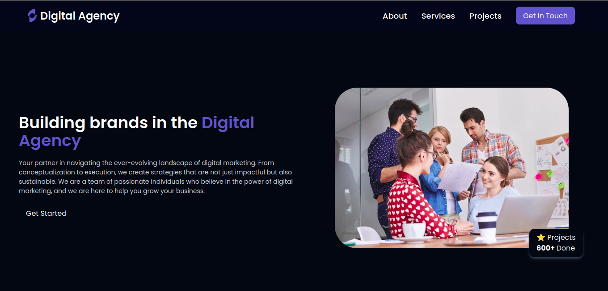

🌟 Digital Agency Platform

A modern, scalable, and feature-rich digital agency platform for businesses to showcase their services, manage projects, and connect with clients seamlessly.

📌 Table of Contents

    🚀 About the Project
    🎯 Project Goals
    🛠️ Features
    💡 Technologies Used
    📂 Folder Structure
    🚀 Getting Started
    💻 Installation
    ⚡ Usage
    📌 Roadmap
    🤝 Contributing
    📄 License
    📬 Contact

🚀 About the Project

The Digital Agency Platform is designed to help creative agencies and freelancers showcase their portfolios, manage client projects, and streamline communication. It provides a modern, intuitive, and user-friendly interface that enhances client engagement and business growth.
🎯 Project Goals

✅ Build a responsive and visually stunning digital agency website.
✅ Allow agencies to showcase portfolios, testimonials, and case studies.
✅ Implement client project management features.
✅ Enable contact forms, live chat, and appointment booking.
✅ Ensure SEO-friendly architecture for better discoverability.
🛠️ Features

🔹 Customizable Landing Page – Highlight your services and achievements.
🔹 Portfolio Showcase – Display projects with detailed case studies.
🔹 Client Testimonials – Build credibility with customer reviews.
🔹 SEO-Optimized – Rank higher on search engines with optimized content.
🔹 Dark Mode Support – Provide an enhanced user experience.
🔹 Mobile-Friendly & Fast – Fully responsive for all devices.

💡 Technologies Used
Technology	Purpose
React.js	Front-End UI Development
Tailwind CSS	Styling and Responsive Design
Framer Motion	Smooth animations and transitions

📂 Folder Structure

📦 digital-agency-platform
 ┣ 📂 src
 ┃ ┣ 📂 components  # Reusable UI components
 ┃ ┣ 📂 pages       # Main application pages
 ┃ ┣ 📂 assets      # Images, logos, and icons
 ┃ ┣ 📂 styles      # Global and component-specific styles
 ┃ ┣ 📂 hooks       # Custom React hooks
 ┃ ┣ 📂 utils       # Utility functions
 ┣ 📜 package.json   # Dependencies and scripts
 ┣ 📜 README.md      # Documentation
 ┗ 📜 .gitignore     # Git ignore file  

🚀 Getting Started
💻 Installation

    Clone the Repository

git clone https://github.com/Joshuakibwage/digital-agency.git
cd digital-agency

    Install Dependencies

npm install  # or yarn install

    Run the Development Server

npm run dev  # or yarn dev

    Open in Browser
    Visit http://localhost:5173/ to view the project.

⚡ Usage

    Home Page – Browse agency services, testimonials, and contact details.
    Portfolio Section – View previous projects with images and descriptions.
    Admin Dashboard – Manage projects, clients, and agency operations.
    SEO Optimization – Improve search rankings with metadata and structured data.

📌 Roadmap

🚀 Version 1.0 (MVP)
✅ Build and deploy the landing page.
✅ Add portfolio and testimonial sections.
✅ Implement dark mode support.

🌟 Version 2.0 (Upcoming Features)
🔹 Live chat and real-time messaging.
🔹 Payment gateway integration (Stripe/PayPal).
🔹 Project collaboration tools for team members.
🔹 AI-powered content suggestions for clients.
🤝 Contributing

Contributions are welcome! To contribute:

    Fork the repository.
    Create a new branch (feature-branch).
    Commit your changes.
    Push to GitHub and submit a PR.

📄 License

This project is open-source under the MIT License.
📬 Contact

📧 Email: Joshuakibwage@gmail.com
🌍 Website: https://Joshuakibwage.varcel.app
🐦 Twitter: @storm_trupa
💼 LinkedIn: www.linkedin.com/in/joshua-kibwage-b19556321/